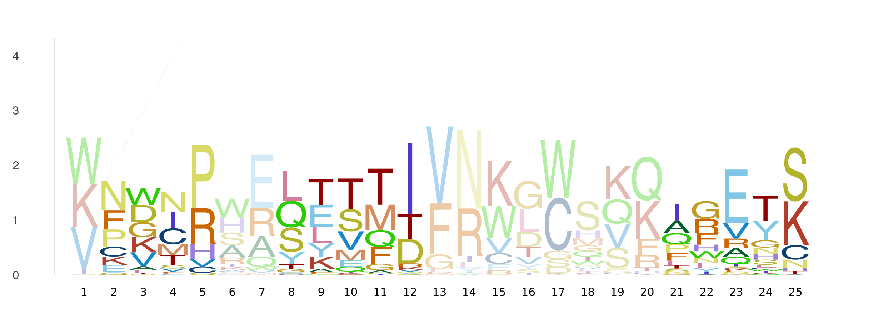

# EntroPlots

[](https://kchu25.github.io/EntroPlots.jl/stable/)
[](https://kchu25.github.io/EntroPlots.jl/dev/)
[](https://github.com/kchu25/EntroPlots.jl/actions/workflows/CI.yml?query=branch%3Amain)
[](https://codecov.io/gh/kchu25/EntroPlots.jl)

# What is this?

EntroPlots is a Julia package for visualizing **position weight matrices (PWMs)**—a widely used representation of biological motifs that indicate DNA or RNA binding preferences. It offers flexible options for plotting classic sequence logos, highlighting specific regions, and visualizing crosslinking signals or protein motifs.

## Table of contents
* [Installation](#Installation)
* [Usage](#Usage)
   - [Plot your typical PWMs](#Plot-your-typical-PWMs)
      - [Save the PWMs](#Save-the-PWMs)
   - [Plot your PWMs with crosslinking tendencies](#Plot-your-PWMs-with-crosslinking-tendencies)
      - [Multiplexed crosslinking tendencies](#Multiplexed-crosslinking-tendencies)
   - [Plot your PWM with highlighted regions](#Plot-your-PWM-with-highlighted-regions)
* [Acknowledgements](#Acknowledgement)
<!-- * [Some-definitions](#Some-definitions) -->


# Installation
To install EntroPlots use Julia's package manager:
```
using Pkg
Pkg.add("EntroPlots")
```

# Usage

## Plot a typical PWM
```
using EntroPlots

# Given a position frequency matrix (PFM), where each column sums to 1

pfm =  [0.02  1.0  0.98  0.0   0.0   0.0   0.98  0.0   0.18  1.0
        0.98  0.0  0.02  0.19  0.0   0.96  0.01  0.89  0.03  0.0
        0.0   0.0  0.0   0.77  0.01  0.0   0.0   0.0   0.56  0.0
        0.0   0.0  0.0   0.04  0.99  0.04  0.01  0.11  0.23  0.0]
```
Define the background probabilities for (A, C, G, T)
```
background = [0.25, 0.25, 0.25, 0.25]
```
Now plot it:

```
logoplot(pfm, background)
```
This produces:


with 
- X-axis: Positions in the PFM
- Y-axis: Information content (in bits)
- Stacked letters: Contribution of each nucleotide

The `background` is an array representing the background probabilities for A, C, G, and T. These should sum to 1. In this example, a uniform background of `[0.25, 0.25, 0.25, 0.25]` is used, assuming equal probabilities for each base.

To use a uniform background, you may simply call:
```
logoplot(pfm)
```

To create a minimal plot without axes/margins:

```
logoplot(pfm; _margin_=0Plots.mm, tight=true, yaxis=false, xaxis=false)
```

Output:


### Saving PWM Plots
To save your plot, use `save_logoplot(pfm, background, save_name)`. For example:
```
save_logoplot(pfm, background, "tmp/logo.png")
```
If you want to use the default uniform background:
```
save_logoplot(pfm, "tmp/logo.png")
```
By default, this assumes `[0.25, 0.25, 0.25, 0.25]` as the background probabilities.

# Advanced Features
## Highlighting Regions
You can highlight specific regions of a PWM using ranges:

```
highlighted_regions1=[4:8]
```
Then call:
```
logoplot_with_highlight(pfm, background, highlighted_regions1)
```
This will produce:


# Protein Motif Logos

To visualize motifs for proteins (20 amino acids), use:

```
# generate an example 
matrix = rand(20, 25)
pfm_protein = matrix ./ sum(matrix, dims=1)
reduce_entropy!(pfm_protein)

# plot
logoplot(pfm_protein; protein=true)
```

### save 
```
save_logoplot(pfm_protein, "logo_protein.png"; protein=true)
```


With region highlights:
```
logoplot_with_highlight(pfm_protein, [2:5, 8:12, 21:25]; protein=true)
```



Save:
```
save_logoplot(pfm_protein, "logo_protein_highlight.png"; protein=true, highlighted_regions = [2:5, 8:12, 21:25])
```
## Acknowledgement
This code repo modifies some of the code using the work from https://github.com/BenjaminDoran/LogoPlots.jl.