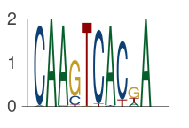
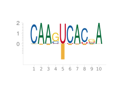
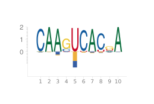
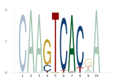
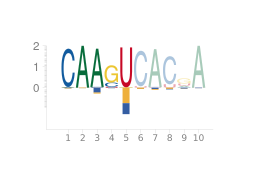
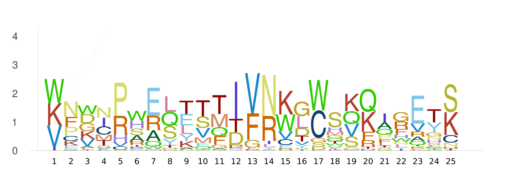

# EntroPlots

[](https://kchu25.github.io/EntroPlots.jl/stable/)
[](https://kchu25.github.io/EntroPlots.jl/dev/)
[](https://github.com/kchu25/EntroPlots.jl/actions/workflows/CI.yml?query=branch%3Amain)
[](https://codecov.io/gh/kchu25/EntroPlots.jl)

# What is this?

EntroPlots is a package for plotting [position weight matrices (PWMs)](https://en.wikipedia.org/wiki/Position_weight_matrix),  which is commonly used to characterize and visualize motifs — the binding sites where proteins interact with DNA or RNA.

## Table of contents
* [Installation](#Installation)
* [Usage](#Usage)
   - [Plot your typical PWMs](#Plot-your-typical-PWMs)
      - [Save the PWMs](#Save-the-PWMs)
   - [Plot your PWMs with crosslinking tendencies](#Plot-your-PWMs-with-crosslinking-tendencies)
      - [Multiplexed crosslinking tendencies](#Multiplexed-crosslinking-tendencies)
   - [Plot your PWM with highlighted regions](#Plot-your-PWM-with-highlighted-regions)
<!-- * [Some-definitions](#Some-definitions) -->


# Installation
To install EntroPlots use Julia's package manager:
```
using Pkg
Pkg.add("EntroPlots")
```

# Usage

## Plot your typical PWMs
```
using EntroPlots

# Given a position frequency matrix (PFM), where each column sums to 1

pfm =  [0.02  1.0  0.98  0.0   0.0   0.0   0.98  0.0   0.18  1.0
        0.98  0.0  0.02  0.19  0.0   0.96  0.01  0.89  0.03  0.0
        0.0   0.0  0.0   0.77  0.01  0.0   0.0   0.0   0.56  0.0
        0.0   0.0  0.0   0.04  0.99  0.04  0.01  0.11  0.23  0.0]

# Define the background probabilities for (A, C, G, T)

background = [0.25, 0.25, 0.25, 0.25]

logoplot(pfm, background)
```
will give



The function `logoplot(pfm, background)` produces a plot where:
- The x-axis shows the positions in the PWM. 
- The y-axis shows the information content (bits) for each position.

The `background` is an array representing the background probabilities for A, C, G, and T. These should sum to 1. In this example, a uniform background of `[0.25, 0.25, 0.25, 0.25]` is used, assuming equal probabilities for each base.

You can also call:
```
logoplot(pfm)
```
to get the same results as above, where the background is set to `[0.25, 0.25, 0.25, 0.25]` by default.

Use
```
logoplot(pfm; _margin_=0Plots.mm, tight=true, yaxis=false, xaxis=false)
```
to take out the x and y -axis in the PWM plot, which gives 


### Save the PWMs
To save your plot, use `save_logoplot(pfm, background, save_name)`. For example:
```
save_logoplot(pfm, background, "tmp/logo.png")
```
Or simply:
```
save_logoplot(pfm, "tmp/logo.png")
```
where a uniform background of `[0.25, 0.25, 0.25, 0.25]` is used implicitly.


## Plot your PWMs with crosslinking tendencies

Cross-linked PWMs not only display the PWM but also account for crosslinking tendencies, which are particularly relevant for the binding sites of [RNA-binding proteins (RBPs)](https://en.wikipedia.org/wiki/RNA-binding_protein) from [CLIP-Seq](https://en.wikipedia.org/wiki/Cross-linking_immunoprecipitation).

To plot these, you'll need to estimate the crosslinking tendencies along with the PFM. For a PFM with $L$ columns, provide a $K \times L$ matrix $C$, where $\sum_{k,\ell}C_{k\ell} \leq 1$.

For example, when $K=1$:
```
C = [0.01  0.04  0.05  0.0  0.74  0.05  0.03  0.05  0.03  0.0] 
```
and the background:
```
background = [0.25, 0.25, 0.25, 0.25]
```

You can then plot the cross-linked PWM using:

```
logoplotwithcrosslink(pfm, background, C; rna=true)
```
This will generate:



Setting the tag `rna=true` will change the logo from using thymine `T` to uracil `U`.

Alternatively, you can use:
```
logoplotwithcrosslink(pfm, C; rna=true)
```
which will automatically assume a uniform background of `[0.25, 0.25, 0.25, 0.25]`.

Use the command
```
save_crosslinked_logoplot(pfm, background, C, "demo1.png")
save_crosslinked_logoplot(pfm, background, C2, "demo2.png")
```
or 
```
save_crosslinked_logoplot(pfm, C, "demo2.png") # uniform background
```
to save the plot.

### Multiplexed crosslinking tendencies

Multiplexed crosslinking tendencies occur when multiple crosslinking signatures are present in the dataset. Each signature can be applied to each sequence before performing motif discovery tasks. This situation corresponds to cases where the crosslink matrix $C$ has more than one row, i.e., $K > 1$."

Suppose we have 
```
C2 = [0.01  0.01  0.03  0.0   0.37  0.03  0.02  0.03  0.01  0.0
     0.01  0.0   0.11  0.01  0.26  0.0   0.03  0.01  0.02  0.01]
```
Now, using
```
logoplotwithcrosslink(pfm, background, C2; rna=true)
```
You'd get 



Here, different colors indicate different crosslinking signatures, and their height is proportional to the crosslinking tendency at each position in the PWM. 

Similar to above, use
```
save_crosslinked_logoplot(pfm, background, C2, "demo3.png"; rna=true)
```
to save the plot.


## Plot your PWM with highlighted regions
Sometimes you may have columns that you want to highlight, for example, when you have transcription factors binding sites embedded in a (long) transposable element (e.g. see figure 4 in this [paper](https://academic.oup.com/bioinformatics/article/39/6/btad378/7192989)). Then, what you can do is to provide a vector of `UnitRange{Int}` to highlight the regions of interest, e.g. 
```
highlighted_regions1=[4:8]
```
and do 
```
logoplot_with_highlight(pfm, background, highlighted_regions1)
```
to get 



You can do it for crosslinked version as well:
```
highlighted_regions2=[1:5]
logoplot_with_highlight_crosslink(pfm, background, C2, highlighted_regions2)
```



<!-- 
save_crosslinked_logoplot(pfm, C2, "tmp.png"; highlighted_regions=highlighted_regions2)-->
 
# For proteins

### Example protein position frequency matrix (PFM)

```
matrix = rand(20, 25)
pfm_protein = matrix ./ sum(matrix, dims=1)
reduce_entropy!(pfm_protein)
logoplot(pfm_protein; protein=true)
```

### save 
```
save_logoplot(pfm_protein, "logo_protein.png"; protein=true)
```


## Acknowledgement
This code repo modifies some of the code using the work from https://github.com/BenjaminDoran/LogoPlots.jl.