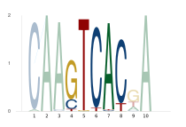
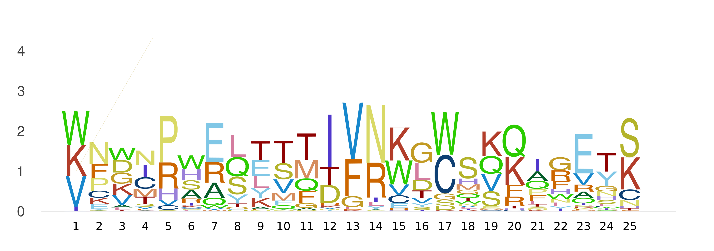
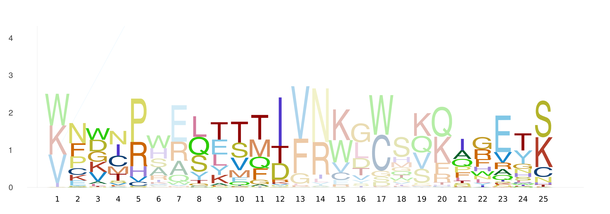

# EntroPlots.jl

[](https://kchu25.github.io/EntroPlots.jl/dev/)
[](https://github.com/kchu25/EntroPlots.jl/actions/workflows/CI.yml?query=branch%3Amain)
[](https://codecov.io/gh/kchu25/EntroPlots.jl)

Sequence logo plots from position frequency matrices (PFMs) — DNA, RNA, and protein.


```julia
using EntroPlots

pfm = [0.02  1.0  0.98  0.0   0.0   0.0   0.98  0.0   0.18  1.0
       0.98  0.0  0.02  0.19  0.0   0.96  0.01  0.89  0.03  0.0
       0.0   0.0  0.0   0.77  0.01  0.0   0.0   0.0   0.56  0.0
       0.0   0.0  0.0   0.04  0.99  0.04  0.01  0.11  0.23  0.0]

logoplot(pfm)
```

## Install

```julia
using Pkg; Pkg.add("EntroPlots")
```

## Reading a logo

- **x-axis**: position in the motif
- **y-axis**: information content in bits (entropy reduction vs. background)
- **letter height**: frequency × information content
- **letter stacking**: most frequent on top

## Cookbook

The PFM `pfm` (4 × N for DNA/RNA, 20 × N for protein, columns sum to 1) is the only required input. Every example below assumes `using EntroPlots` and reuses the `pfm` from above.

### Custom background frequencies

```julia
logoplot(pfm, [0.3, 0.2, 0.2, 0.3])  # A, C, G, T
```

### Minimal styling (no margins, no axes)

```julia
using Plots  # for `Plots.mm`
logoplot(pfm; _margin_=0Plots.mm, tight=true, yaxis=false, xaxis=false)
```


### Highlight regions of interest

```julia
logoplot_with_highlight(pfm, [4:8])
```



Tight variant:

```julia
using Plots
logoplot_with_highlight(pfm, [4:8]; _margin_=0Plots.mm, tight=true)
```


### Protein motifs (20 amino acids)

```julia
matrix = rand(20, 25)
pfm_protein = matrix ./ sum(matrix, dims=1)
reduce_entropy!(pfm_protein)  # sharpen toward dominant residue per column

logoplot(pfm_protein; protein=true)
logoplot_with_highlight(pfm_protein, [2:5, 8:12, 21:25]; protein=true)
```




### RNA motifs

```julia
logoplot(pfm; rna=true)  # uses A, C, G, U
```

### Saving to file

```julia
save_logoplot(pfm, "logo.png")                          # default uniform background
save_logoplot(pfm, [0.3, 0.2, 0.2, 0.3], "logo.png")    # custom background
save_logoplot(pfm_protein, "protein.png"; protein=true)
save_logoplot(pfm, "highlighted.png"; highlighted_regions=[4:8])
```

## API

| Function | Purpose |
|---|---|
| `logoplot(pfm[, background]; kwargs...)` | Render a logo plot. |
| `logoplot_with_highlight(pfm[, background], regions; kwargs...)` | Render with selected positions highlighted. |
| `save_logoplot(pfm[, background], path; kwargs...)` | Save to file (PNG / SVG / etc., inferred from extension). |
| `reduce_entropy!(pfm; factor=10)` | Sharpen each column toward its dominant residue. Useful for noisy protein PFMs. |

Common keyword arguments: `protein`, `rna`, `tight`, `_margin_`, `xaxis`, `yaxis`, `dpi`, `alpha`, `beta`, `uniform_color`, `pos`, `xrotation`, `scale_by_frequency`.

## Acknowledgments

Glyph data and base recipe pattern are adapted from [LogoPlots.jl](https://github.com/BenjaminDoran/LogoPlots.jl).
