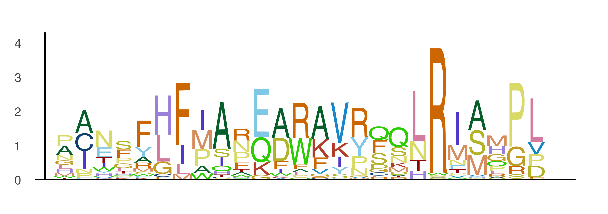

# EntroPlots.jl

[](https://kchu25.github.io/EntroPlots.jl/stable/)
[](https://kchu25.github.io/EntroPlots.jl/dev/)
[](https://github.com/kchu25/EntroPlots.jl/actions/workflows/CI.yml?query=branch%3Amain)
[](https://codecov.io/gh/kchu25/EntroPlots.jl)

A Julia package for creating sequence logo plots from position frequency matrices (PFMs). EntroPlots.jl visualizes DNA, RNA, and protein motifs with information-theoretic scaling, custom backgrounds, and flexible highlighting options.

## Features

- **DNA/RNA motifs**: Standard 4-letter nucleotide logos
- **Protein motifs**: 20 amino acid sequence visualization  
- **Custom backgrounds**: Non-uniform base/amino acid frequencies
- **Region highlighting**: Emphasize important motif positions
- **Publication ready**: Clean styling with PNG/SVG output
- **Information content**: Proper bits scaling based on entropy reduction


## Installation

```julia
using Pkg
Pkg.add("EntroPlots")
```

## Quick Start

```julia
using EntroPlots

# Position frequency matrix (each column sums to 1)
pfm = [0.02  1.0  0.98  0.0   0.0   0.0   0.98  0.0   0.18  1.0
       0.98  0.0  0.02  0.19  0.0   0.96  0.01  0.89  0.03  0.0
       0.0   0.0  0.0   0.77  0.01  0.0   0.0   0.0   0.56  0.0
       0.0   0.0  0.0   0.04  0.99  0.04  0.01  0.11  0.23  0.0]

# Create logo plot
logoplot(pfm)
```


## Usage
### Basic Plotting

```julia
# With custom background probabilities
background = [0.25, 0.25, 0.25, 0.25]  # A, C, G, T
logoplot(pfm, background)

# With uniform background (default)
logoplot(pfm)

# Minimal styling
logoplot(pfm; _margin_=0Plots.mm, tight=true, yaxis=false, xaxis=false)
```


### Highlighting Regions

Emphasize specific positions in your motif:

```julia
highlighted_regions = [4:8]
logoplot_with_highlight(pfm, background, highlighted_regions)
```


### Protein Motifs

For protein sequences (20 amino acids):

```julia
# Generate example protein data
matrix = rand(20, 25)
pfm_protein = matrix ./ sum(matrix, dims=1)
reduce_entropy!(pfm_protein)

# Plot protein logo
logoplot(pfm_protein; protein=true)
```



With highlighting:

```julia
logoplot_with_highlight(pfm_protein, [2:5, 8:12, 21:25]; protein=true)
```


### Saving Plots

```julia
# Save DNA/RNA logos
save_logoplot(pfm, background, "logo.png")
save_logoplot(pfm, "logo.png")  # uses default background

# Save protein logos  
save_logoplot(pfm_protein, "protein_logo.png"; protein=true)
save_logoplot(pfm_protein, "protein_highlight.png"; 
              protein=true, highlighted_regions=[2:5, 8:12])
```

## API Reference

The package provides a simple interface centered around these main functions:

- `logoplot(pfm, background=nothing; kwargs...)` - Create a logo plot
- `logoplot_with_highlight(pfm, regions; kwargs...)` - Plot with highlighted regions  
- `save_logoplot(pfm, filename; kwargs...)` - Save plot to file
- `reduce_entropy!(pfm)` - Apply entropy reduction (useful for protein data)

**Plot interpretation:**
- **X-axis**: Position in the sequence motif
- **Y-axis**: Information content (bits) 
- **Letter height**: Proportional to frequency × information content
- **Letter stacking**: Most frequent nucleotides/amino acids on top

## Acknowledgments

This package builds upon and modifies code from [LogoPlots.jl](https://github.com/BenjaminDoran/LogoPlots.jl).