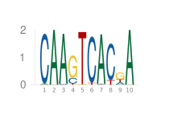
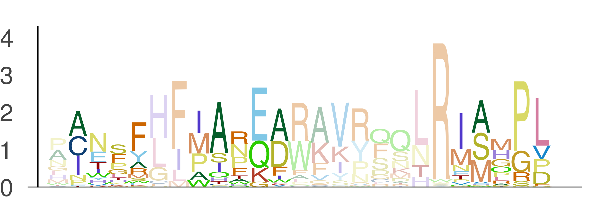

# EntroPlots

[](https://kchu25.github.io/EntroPlots.jl/stable/)
[](https://kchu25.github.io/EntroPlots.jl/dev/)
[](https://github.com/kchu25/EntroPlots.jl/actions/workflows/CI.yml?query=branch%3Amain)
[](https://codecov.io/gh/kchu25/EntroPlots.jl)

# What is this?

EntroPlots is a package for plotting [position weight matrices (PWMs)](https://en.wikipedia.org/wiki/Position_weight_matrix),  which is commonly used to characterize and visualize motifs — the binding sites where proteins interact with DNA or RNA.

## Table of contents
* [Installation](#Installation)
* [Usage](#Usage)
   - [Plot your typical PWMs](#Plot-your-typical-PWMs)
      - [Save the PWMs](#Save-the-PWMs)
   - [Plot your PWMs with crosslinking tendencies](#Plot-your-PWMs-with-crosslinking-tendencies)
      - [Multiplexed crosslinking tendencies](#Multiplexed-crosslinking-tendencies)
   - [Plot your PWM with highlighted regions](#Plot-your-PWM-with-highlighted-regions)
<!-- * [Some-definitions](#Some-definitions) -->


# Installation
To install EntroPlots use Julia's package manager:
```
using Pkg
Pkg.add("EntroPlots")
```

# Usage

## Plot your typical PWMs
```
using EntroPlots

# Given a position frequency matrix (PFM), where each column sums to 1

pfm =  [0.02  1.0  0.98  0.0   0.0   0.0   0.98  0.0   0.18  1.0
        0.98  0.0  0.02  0.19  0.0   0.96  0.01  0.89  0.03  0.0
        0.0   0.0  0.0   0.77  0.01  0.0   0.0   0.0   0.56  0.0
        0.0   0.0  0.0   0.04  0.99  0.04  0.01  0.11  0.23  0.0]
```
Define the background probabilities for (A, C, G, T)
```
background = [0.25, 0.25, 0.25, 0.25]
```
Now plot it:

```
logoplot(pfm, background)
```
This generates:



The plot shows:
- X-axis: Positions in the PFM
- Y-axis: Information content (in bits)

Each stack represents the relative contribution of each base at a given position.

The `background` is an array representing the background probabilities for A, C, G, and T. These should sum to 1. In this example, a uniform background of `[0.25, 0.25, 0.25, 0.25]` is used, assuming equal probabilities for each base.

## Defaults and Options
Calling `logoplot(pfm)` uses the default uniform background:
```
logoplot(pfm)
```

You can remove axes and margins for a cleaner look:

```
logoplot(pfm; _margin_=0Plots.mm, tight=true, yaxis=false, xaxis=false)
```

Output:


### Save the PWMs
To save your plot, use `save_logoplot(pfm, background, save_name)`. For example:
```
save_logoplot(pfm, background, "tmp/logo.png")
```
You can also omit the background argument to use the default uniform background:
```
save_logoplot(pfm, "tmp/logo.png")
```
By default, this assumes `[0.25, 0.25, 0.25, 0.25]` as the background probabilities.

## Plot your PWM with highlighted regions
Sometimes, you may want to highlight specific columns in your PWM—such as known transcription factor binding sites within a longer sequence (e.g. see figure 4 in this [paper](https://academic.oup.com/bioinformatics/article/39/6/btad378/7192989)). To do so, provide a vector of `UnitRange{Int}` that specifies the regions of interest. For example:

```
highlighted_regions1=[4:8]
```
Then call:
```
logoplot_with_highlight(pfm, background, highlighted_regions1)
```
This will produce:


# For proteins

### Example protein position frequency matrix (PFM)

```
matrix = rand(20, 25)
pfm_protein = matrix ./ sum(matrix, dims=1)
reduce_entropy!(pfm_protein)
logoplot(pfm_protein; protein=true)
```

### save 
```
save_logoplot(pfm_protein, "logo_protein.png"; protein=true)
```


With highlight:
```
logoplot_with_highlight(pfm_protein, [2:5, 8:12, 21:25]; protein=true)
```



Save:
```
save_logoplot(pfm_protein, "logo_protein_highlight.png"; protein=true, highlighted_regions = [2:5, 8:12, 21:25])
```
## Acknowledgement
This code repo modifies some of the code using the work from https://github.com/BenjaminDoran/LogoPlots.jl.