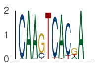

```@meta
CurrentModule = EntroPlots
```

# EntroPlots

Sequence logo plots from position frequency matrices (PFMs) — for **DNA, RNA, and
protein** motifs.

Documentation for [EntroPlots](https://github.com/kchu25/EntroPlots.jl).



```julia
using EntroPlots

pfm = [0.02  1.0  0.98  0.0   0.0   0.0   0.98  0.0   0.18  1.0
       0.98  0.0  0.02  0.19  0.0   0.96  0.01  0.89  0.03  0.0
       0.0   0.0  0.0   0.77  0.01  0.0   0.0   0.0   0.56  0.0
       0.0   0.0  0.0   0.04  0.99  0.04  0.01  0.11  0.23  0.0]

logoplot(pfm)
```

## Installation

```julia
using Pkg; Pkg.add("EntroPlots")
```

## Reading a logo

- **x-axis** — position in the motif.
- **y-axis** — information content in bits (entropy reduction relative to the background).
- **letter height** — frequency × information content.
- **letter stacking** — most frequent symbol on top.

The PFM (`4 × N` for DNA/RNA, `20 × N` for protein, columns summing to 1) is the only
required input.

## Next steps

- **[Guide](guide.md)** — a cookbook of common tasks: custom backgrounds, minimal styling,
  highlighting regions, protein and RNA motifs, and saving to file.
- **[API Reference](api.md)** — full documentation of every exported function.

## Acknowledgments

Glyph data and the base recipe pattern are adapted from
[LogoPlots.jl](https://github.com/BenjaminDoran/LogoPlots.jl).
